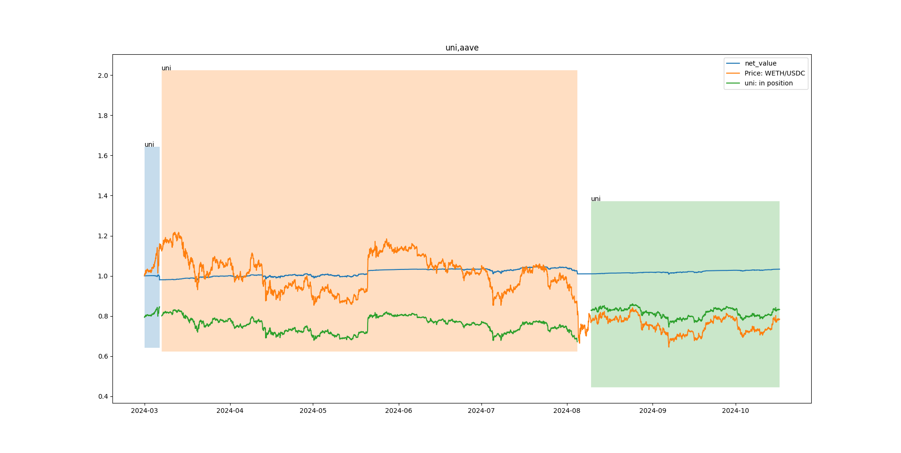

# delta-hedging

https://medium.com/zelos-research/how-to-implement-uniswap-delta-neutral-strategy-with-lending-protocol-eee10371a77f

steps:

* choose h and l
* calculate sigma, and price range of liquidity position will be 1-sigma*l, 1+sigma*h
* Calculating how to allocate funds in a portfolio.
* Supply usdc to aave 
* borrow eth
* add liquidity. 
* if net value has changed to 98% or price if out of position price range, adjust the portfolio

performance

| item                  | value               |
|-----------------------|---------------------|
| Start period          | 2024-03-01 00:00:00 |
| End period            | 2024-10-16 23:00:00 |
| Duration              | 230 days 00:00:00   |
| Return                | 332.10468           |
| Rate of Return        | 0.033212            |
| APR                   | 0.053217            |
| Max Draw Down         | 0.036655            |
| Sharpe Ratio          | 0.351987            |
| Volatility            | 0.06596             |
| Alpha                 | 0.073625            |
| Beta                  | 0.063675            |
| Benchmark return rate | -0.216111           |
| Benchmark APR         | -0.320504           |

